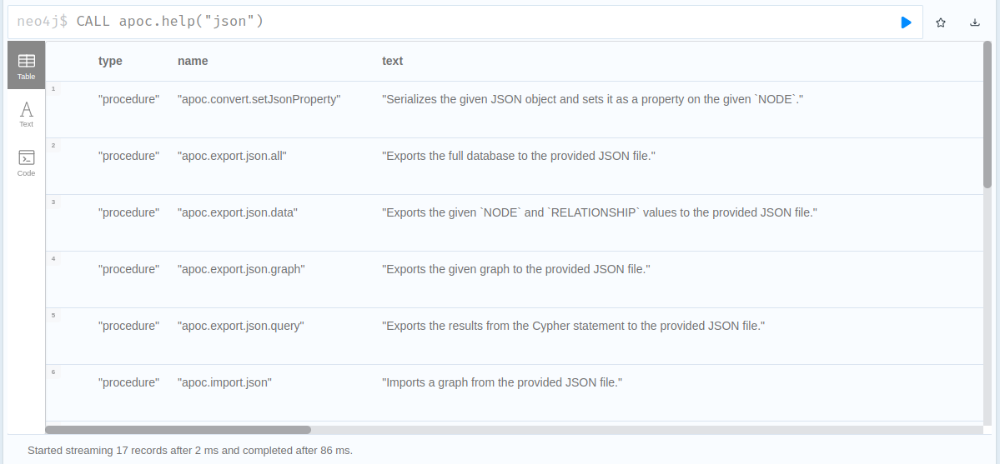
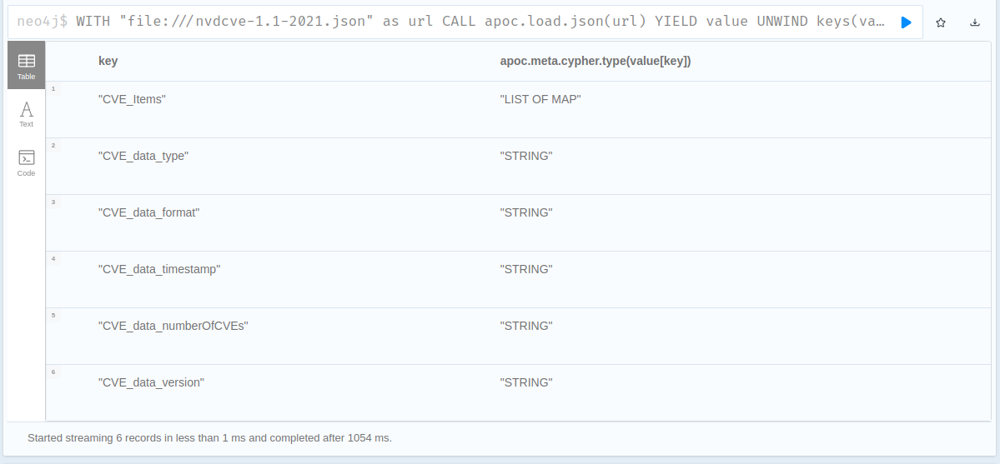
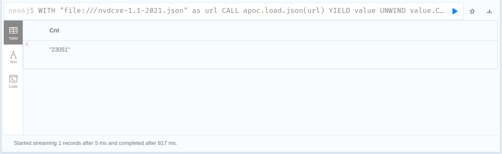
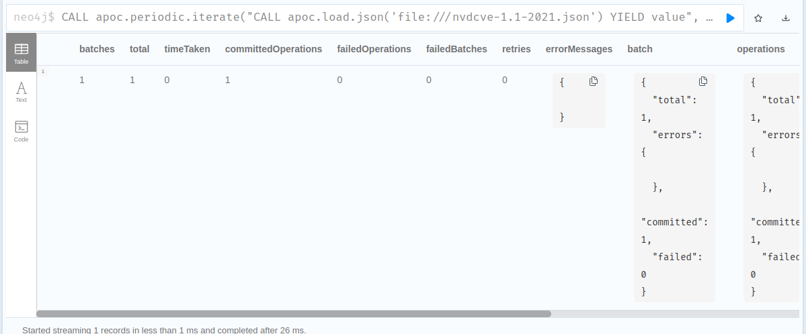

# Activity 3

```
CALL apoc.help("json")
```



```
WITH "file:///nvdcve-1.1-2021.json" as url 
CALL apoc.load.json(url) YIELD value 
UNWIND keys(value) AS key
RETURN key, apoc.meta.cypher.type(value[key]);
```



```
WITH "file:///nvdcve-1.1-2021.json" as url 
CALL apoc.load.json(url) YIELD value 
UNWIND  value.CVE_data_numberOfCVEs as Cnt
RETURN Cnt
```



```
CALL apoc.periodic.iterate("CALL apoc.load.json('file:///nvdcve-1.1-2021.json') YIELD value",
"UNWIND  value.CVE_Items AS data  \r\n"+
"UNWIND data.cve.references.reference_data AS references \r\n"+
"MERGE (cveItem:CVE {uid: apoc.create.uuid()}) \r\n"+
"ON CREATE SET cveItem.cveid = data.cve.CVE_data_meta.ID, cveItem.references = references.url",
 {batchSize:100, iterateList:true});
```



Note: to make it work I needed to reduce the json size to 100 lines.
