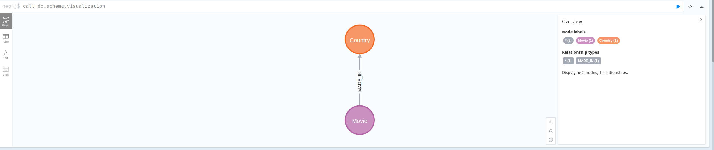
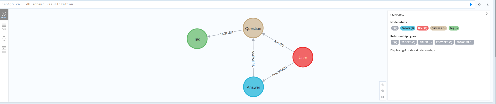

# Neo4j

## CSV Import

```cypher
LOAD CSV WITH HEADERS FROM 'file:///movies.csv' AS csvLine
MERGE (country:Country { name: csvLine.country })
CREATE (movie:Movie { id: toInteger(csvLine.id), title: csvLine.title, year:toInteger(csvLine.year)})
CREATE (movie)-[:MADE_IN]->(country)
```

```cypher
call db.schema.visualization
```



## JSON Import

```cypher
CALL apoc.load.json('file:///data.json') YIELD value
UNWIND value.items as item

MERGE (question:Question {
    id: item.question_id,
    title: item.title,
    score: item.score,
    view_count: item.view_count,
    creation_date: datetime({epochSeconds: item.creation_date})
})

WITH item, question
UNWIND item.tags as tagName
MERGE (tag:Tag {name: tagName})
CREATE (question)-[:TAGGED]->(tag)

WITH item, question
MERGE (author:User {
    id: item.owner.user_id,
    display_name: item.owner.display_name,
    reputation: item.owner.reputation
})
CREATE (author)-[:ASKED]->(question)

WITH item, question
UNWIND item.answers as answerData
MERGE (answer:Answer {
    id: answerData.answer_id,
    score: answerData.score,
    is_accepted: answerData.is_accepted,
    creation_date: datetime({epochSeconds: answerData.creation_date})
})
CREATE (answer)-[:ANSWERS]->(question)

MERGE (answerer:User {
    id: answerData.owner.user_id,
    display_name: answerData.owner.display_name,
    reputation: answerData.owner.reputation
})
CREATE (answerer)-[:PROVIDED]->(answer);
```

```cypher
call db.schema.visualization
```


