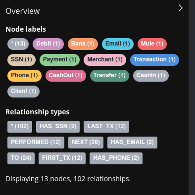

# Neo4J

## 4. Fraud Detection Dataset

- Schema Visualization
- Nodes Count
- Relationships Count
- Node Labels and their Count
- Relationship Types and their Count

### Schema

```cyper
CALL db.schema.visualization
```

Schema visualization:



Overview


### Node Count

```cypher
MATCH (n)
RETURN count(n)
```

Node count: 332973

### Relationship Count

```cypher
MATCH ()-[r]->()
RETURN count(r)
```

Relationship count: 980098

### Node Types

```cypher
CALL db.labels()
```

```
╒═════════════╕
│label        │
╞═════════════╡
│"Client"     │
├─────────────┤
│"Bank"       │
├─────────────┤
│"Merchant"   │
├─────────────┤
│"Mule"       │
├─────────────┤
│"CashIn"     │
├─────────────┤
│"CashOut"    │
├─────────────┤
│"Debit"      │
├─────────────┤
│"Payment"    │
├─────────────┤
│"Transfer"   │
├─────────────┤
│"Transaction"│
├─────────────┤
│"Email"      │
├─────────────┤
│"SSN"        │
├─────────────┤
│"Phone"      │
└─────────────┘
```

### Relationship Types

```cypher
CALL db.relationshipTypes()
```

```
╒════════════════╕
│relationshipType│
╞════════════════╡
│"PERFORMED"     │
├────────────────┤
│"TO"            │
├────────────────┤
│"HAS_SSN"       │
├────────────────┤
│"HAS_EMAIL"     │
├────────────────┤
│"HAS_PHONE"     │
├────────────────┤
│"FIRST_TX"      │
├────────────────┤
│"LAST_TX"       │
├────────────────┤
│"NEXT"          │
└────────────────┘
```

### Using apoc

```cypher
CALL apoc.meta.stats()
```

```
╒══════════╤════════════╤════════════════╤═════════╤════════╤══════════════════════════════════════════════════════════════════════╤══════════════════════════════════════════════════════════════════════╤══════════════════════════════════════════════════════════════════════╤══════════════════════════════════════════════════════════════════════╕
│labelCount│relTypeCount│propertyKeyCount│nodeCount│relCount│labels                                                                │relTypes                                                              │relTypesCount                                                         │stats                                                                 │
╞══════════╪════════════╪════════════════╪═════════╪════════╪══════════════════════════════════════════════════════════════════════╪══════════════════════════════════════════════════════════════════════╪══════════════════════════════════════════════════════════════════════╪══════════════════════════════════════════════════════════════════════╡
│13        │8           │10              │332973   │980098  │{Phone: 2234, Transaction: 323489, SSN: 2238, Merchant: 347, Bank: 3, │{(:CashIn)-[:TO]->(): 149037, ()-[:PERFORMED]->(:Transaction): 323489,│{HAS_SSN: 2433, NEXT: 321157, PERFORMED: 323489, FIRST_TX: 2332, TO: 3│{relTypeCount: 8, labelCount: 13, relTypes: {(:CashIn)-[:TO]->(): 1490│
│          │            │                │         │        │Payment: 74577, CashOut: 76023, Transfer: 19460, Mule: 433, Email: 222│ ()-[:PERFORMED]->(:CashIn): 149037, (:Client)-[:HAS_PHONE]->(): 2433,│23489, HAS_EMAIL: 2433, LAST_TX: 2332, HAS_PHONE: 2433}               │37, ()-[:PERFORMED]->(:Transaction): 323489, ()-[:PERFORMED]->(:CashIn│
│          │            │                │         │        │9, CashIn: 149037, Debit: 4392, Client: 2433}                         │ (:Client)-[:PERFORMED]->(): 323489, ()-[:LAST_TX]->(:Debit): 89, ()-[│                                                                      │): 149037, (:Client)-[:HAS_PHONE]->(): 2433, (:Client)-[:PERFORMED]->(│
│          │            │                │         │        │                                                                      │:TO]->(:Mule): 2363, ()-[:TO]->(:Merchant): 299637, ()-[:HAS_PHONE]->(│                                                                      │): 323489, ()-[:LAST_TX]->(:Debit): 89, ()-[:TO]->(:Mule): 2363, ()-[:│
│          │            │                │         │        │                                                                      │:Phone): 2433, ()-[:NEXT]->(:CashOut): 75999, (:Client)-[:FIRST_TX]->(│                                                                      │TO]->(:Merchant): 299637, ()-[:HAS_PHONE]->(:Phone): 2433, ()-[:NEXT]-│
│          │            │                │         │        │                                                                      │): 2332, (:Transaction)-[:NEXT]->(): 321157, ()-[:LAST_TX]->(:Transfer│                                                                      │>(:CashOut): 75999, (:Client)-[:FIRST_TX]->(): 2332, (:Transaction)-[:│
│          │            │                │         │        │                                                                      │): 535, ()-[:HAS_EMAIL]->(): 2433, (:Transfer)-[:TO]->(): 19460, (:Pay│                                                                      │NEXT]->(): 321157, ()-[:LAST_TX]->(:Transfer): 535, ()-[:HAS_EMAIL]->(│
│          │            │                │         │        │                                                                      │ment)-[:TO]->(): 74577, ()-[:FIRST_TX]->(): 2332, ()-[:LAST_TX]->(:Tra│                                                                      │): 2433, (:Transfer)-[:TO]->(): 19460, (:Payment)-[:TO]->(): 74577, ()│
│          │            │                │         │        │                                                                      │nsaction): 2332, ()-[:FIRST_TX]->(:CashIn): 1903, ()-[:PERFORMED]->(:C│                                                                      │-[:FIRST_TX]->(): 2332, ()-[:LAST_TX]->(:Transaction): 2332, ()-[:FIRS│
│          │            │                │         │        │                                                                      │ashOut): 76023, ()-[:PERFORMED]->(:Transfer): 19460, (:Client)-[:LAST_│                                                                      │T_TX]->(:CashIn): 1903, ()-[:PERFORMED]->(:CashOut): 76023, ()-[:PERFO│
│          │            │                │         │        │                                                                      │TX]->(): 2332, ()-[:NEXT]->(:Transaction): 321157, (:Transaction)-[:TO│                                                                      │RMED]->(:Transfer): 19460, (:Client)-[:LAST_TX]->(): 2332, ()-[:NEXT]-│
│          │            │                │         │        │                                                                      │]->(): 323489, (:CashIn)-[:NEXT]->(): 148578, (:Client)-[:HAS_SSN]->()│                                                                      │>(:Transaction): 321157, (:Transaction)-[:TO]->(): 323489, (:CashIn)-[│
│          │            │                │         │        │                                                                      │: 2433, ()-[:PERFORMED]->(): 323489, ()-[:PERFORMED]->(:Debit): 4392, │                                                                      │:NEXT]->(): 148578, (:Client)-[:HAS_SSN]->(): 2433, ()-[:PERFORMED]->(│
│          │            │                │         │        │                                                                      │()-[:NEXT]->(:Transfer): 19116, ()-[:LAST_TX]->(:CashIn): 459, (:Debit│                                                                      │): 323489, ()-[:PERFORMED]->(:Debit): 4392, ()-[:NEXT]->(:Transfer): 1│
│          │            │                │         │        │                                                                      │)-[:NEXT]->(): 4303, ()-[:TO]->(:Bank): 4392, ()-[:TO]->(:Client): 194│                                                                      │9116, ()-[:LAST_TX]->(:CashIn): 459, (:Debit)-[:NEXT]->(): 4303, ()-[:│
│          │            │                │         │        │                                                                      │60, (:Client)-[:HAS_EMAIL]->(): 2433, ()-[:LAST_TX]->(:Payment): 654, │                                                                      │TO]->(:Bank): 4392, ()-[:TO]->(:Client): 19460, (:Client)-[:HAS_EMAIL]│
│          │            │                │         │        │                                                                      │()-[:NEXT]->(:CashIn): 147134, ()-[:FIRST_TX]->(:CashOut): 24, ()-[:FI│                                                                      │->(): 2433, ()-[:LAST_TX]->(:Payment): 654, ()-[:NEXT]->(:CashIn): 147│
│          │            │                │         │        │                                                                      │RST_TX]->(:Payment): 47, ()-[:TO]->(): 323489, (:Debit)-[:TO]->(): 439│                                                                      │134, ()-[:FIRST_TX]->(:CashOut): 24, ()-[:FIRST_TX]->(:Payment): 47, (│
│          │            │                │         │        │                                                                      │2, (:CashOut)-[:NEXT]->(): 75428, (:Mule)-[:HAS_SSN]->(): 433, (:Mule)│                                                                      │)-[:TO]->(): 323489, (:Debit)-[:TO]->(): 4392, (:CashOut)-[:NEXT]->():│
│          │            │                │         │        │                                                                      │-[:PERFORMED]->(): 333, ()-[:LAST_TX]->(:CashOut): 595, (:Mule)-[:LAST│                                                                      │ 75428, (:Mule)-[:HAS_SSN]->(): 433, (:Mule)-[:PERFORMED]->(): 333, ()│
│          │            │                │         │        │                                                                      │_TX]->(): 333, (:Payment)-[:NEXT]->(): 73923, ()-[:NEXT]->(): 321157, │                                                                      │-[:LAST_TX]->(:CashOut): 595, (:Mule)-[:LAST_TX]->(): 333, (:Payment)-│
│          │            │                │         │        │                                                                      │()-[:NEXT]->(:Debit): 4378, (:Transfer)-[:NEXT]->(): 18925, ()-[:FIRST│                                                                      │[:NEXT]->(): 73923, ()-[:NEXT]->(): 321157, ()-[:NEXT]->(:Debit): 4378│
│          │            │                │         │        │                                                                      │_TX]->(:Transfer): 344, ()-[:FIRST_TX]->(:Debit): 14, ()-[:HAS_SSN]->(│                                                                      │, (:Transfer)-[:NEXT]->(): 18925, ()-[:FIRST_TX]->(:Transfer): 344, ()│
│          │            │                │         │        │                                                                      │:SSN): 2433, ()-[:PERFORMED]->(:Payment): 74577, ()-[:HAS_EMAIL]->(:Em│                                                                      │-[:FIRST_TX]->(:Debit): 14, ()-[:HAS_SSN]->(:SSN): 2433, ()-[:PERFORME│
│          │            │                │         │        │                                                                      │ail): 2433, (:CashOut)-[:TO]->(): 76023, (:Mule)-[:HAS_PHONE]->(): 433│                                                                      │D]->(:Payment): 74577, ()-[:HAS_EMAIL]->(:Email): 2433, (:CashOut)-[:T│
│          │            │                │         │        │                                                                      │, ()-[:NEXT]->(:Payment): 74530, ()-[:HAS_PHONE]->(): 2433, ()-[:LAST_│                                                                      │O]->(): 76023, (:Mule)-[:HAS_PHONE]->(): 433, ()-[:NEXT]->(:Payment): │
│          │            │                │         │        │                                                                      │TX]->(): 2332, (:Mule)-[:HAS_EMAIL]->(): 433, ()-[:FIRST_TX]->(:Transa│                                                                      │74530, ()-[:HAS_PHONE]->(): 2433, ()-[:LAST_TX]->(): 2332, (:Mule)-[:H│
│          │            │                │         │        │                                                                      │ction): 2332, ()-[:HAS_SSN]->(): 2433, (:Mule)-[:FIRST_TX]->(): 333}  │                                                                      │AS_EMAIL]->(): 433, ()-[:FIRST_TX]->(:Transaction): 2332, ()-[:HAS_SSN│
│          │            │                │         │        │                                                                      │                                                                      │                                                                      │]->(): 2433, (:Mule)-[:FIRST_TX]->(): 333}, relCount: 980098, labels: │
│          │            │                │         │        │                                                                      │                                                                      │                                                                      │{Phone: 2234, Transaction: 323489, SSN: 2238, Merchant: 347, Bank: 3, │
│          │            │                │         │        │                                                                      │                                                                      │                                                                      │Payment: 74577, CashOut: 76023, Transfer: 19460, Mule: 433, Email: 222│
│          │            │                │         │        │                                                                      │                                                                      │                                                                      │9, CashIn: 149037, Debit: 4392, Client: 2433}, propertyKeyCount: 10, n│
│          │            │                │         │        │                                                                      │                                                                      │                                                                      │odeCount: 332973}                                                     │
└──────────┴────────────┴────────────────┴─────────┴────────┴──────────────────────────────────────────────────────────────────────┴──────────────────────────────────────────────────────────────────────┴──────────────────────────────────────────────────────────────────────┴──────────────────────────────────────────────────────────────────────┘
```

Create a new relationship

Create a new relationship to connect clients that share identifiers and add the number of shared identifiers as a property on that relationship

MATCH (c1:Client)-[:HAS_EMAIL|:HAS_PHONE|:HAS_SSN] ->(n)<- [:HAS_EMAIL|:HAS_PHONE|:HAS_SSN]-(c2:Client)
WHERE id(c1) < id(c2)
WITH c1, c2, count(*) as cnt
MERGE (c1) - [:SHARED_IDENTIFIERS {count: cnt}] -> (c2);

Visualize the new relationship created above.

MATCH p = (:Client) - [s:SHARED_IDENTIFIERS] -> (:Client) WHERE s.count >= 2 RETURN p limit 25;


Graph Algorithms

Graph algorithms are used to compute metrics for graphs, nodes, or relationships.

They can provide insights on relevant entities in the graph (centralities, ranking), or inherent structures like communities (community-detection, graph-partitioning, clustering).

The Neo4j Graph Data Science (GDS) library contains many graph algorithms. The algorithms are divided into categories which represent different problem classes. For more information, please click here: Algorithms


Fraud detection workflow in Neo4j GDS

We will construct a workflow with graph algorithms to detect fraud rings, score clients based on the number of common connections and rank them to select the top few suspicious clients and label them as fraudsters.

    Identify clusters of clients sharing PII using a community detection algorithm (Weakly Connected Components)

    Find similar clients within the clusters using pairwise similarity algorithms (Node Similarity)

    Calculate and assign fraud score to clients using centrality algorithms (Degree Centrality) and

    Use computed fraud scores to label clients as potential fraudsters

Graph Projection

A central concept in the GDS library is the management of in-memory graphs. Graph algorithms run on a graph data model which is a projection of the Neo4j property graph data model. For more information, please click here: Graph Management

A projected graph can be stored in the catalog under a user-defined name. Using that name, the graph can be referred to by any algorithm in the library.


CALL gds.graph.project('wcc',
    {
        Client: {
            label: 'Client'
        }
    },
    {
        SHARED_IDENTIFIERS:{
            type: 'SHARED_IDENTIFIERS',
            orientation: 'UNDIRECTED',
            properties: {
                count: {
                    property: 'count'
                }
            }
        }
    }
) YIELD graphName,nodeCount,relationshipCount,projectMillis;

## 5. Find out what types of transactions do these Clients perform with first party fraudsters?

```scala
import org.apache.spark.sql.SparkSession

object Exam {
  def main(args: Array[String]): Unit = {

    val url = "neo4j://neo4j:7687"
    val username = "neo4j"
    val password = "neo4j"
    val dbname = "neo4j"

    val spark = SparkSession.builder
      .appName("Neo4J to spark Application")
      .config("neo4j.url", url)
      .config("neo4j.authentication.basic.username", username)
      .config("neo4j.authentication.basic.password", password)
      .config("neo4j.database", dbname)
      .getOrCreate()

    spark.read
      .format("org.neo4j.spark.DataSource")
      .option("labels", "Client")
      .load()
      .show()

    println("Question 5: Find out what types of transactions do these Clients perform with first party fraudsters?")
    println("--------------------------------")
    spark.read
      .format("org.neo4j.spark.DataSource")
      .option("query", """
        MATCH (:Client:FirstPartyFraudster)-[]-(txn:Transaction)-[]-(c:Client)
        WHERE NOT c:FirstPartyFraudster
        UNWIND labels(txn) AS transactionType
        RETURN transactionType, count(*) AS freq
      """)
      .load()
      .show()
    println("--------------------------------")

    spark.stop()
  }
}
```

```cypher
MATCH (:Client:FirstPartyFraudster)-[]-(txn:Transaction)-[]-(c:Client)
WHERE NOT c:FirstPartyFraudster
UNWIND labels(txn) AS transactionType
RETURN transactionType, count(*) AS freq
```

[q5-output](q5-output.png)

## 6. How many clusters of FraudRings with greater than 10 client nodes.

Frist we create the graph

```cypher
CALL gds.graph.project('fraudRings',
  'Client',
  'SHARED_IDENTIFIERS',
  {nodeProperties: ['firstPartyFraudGroup']}
)
```

Then we find the clusters with more than 9 nodes

```cypher
CALL gds.wcc.stream('fraudRings')
YIELD nodeId, componentId
WITH componentId, collect(nodeId) as nodes
WITH componentId, nodes, size(nodes) as clusterSize
WHERE clusterSize > 9
WITH componentId, nodes
UNWIND nodes as nodeId
WITH componentId, gds.util.asNode(nodeId) as node
RETURN componentId, collect(node) as cluster
```

[q6-output](q6-output.png)

## 7. How many clusters of FraudRings with greater than 10 client nodes.

```cypher
CALL gds.wcc.stream('fraudRings')
YIELD nodeId, componentId
WITH componentId, collect(nodeId) as nodes
WITH componentId, nodes, size(nodes) as clusterSize
WHERE clusterSize > 10
WITH componentId, nodes
UNWIND nodes as nodeId
WITH componentId, gds.util.asNode(nodeId) as node
RETURN componentIdcollect(node) as cluster
```

[q7-output](q7-output.png)
